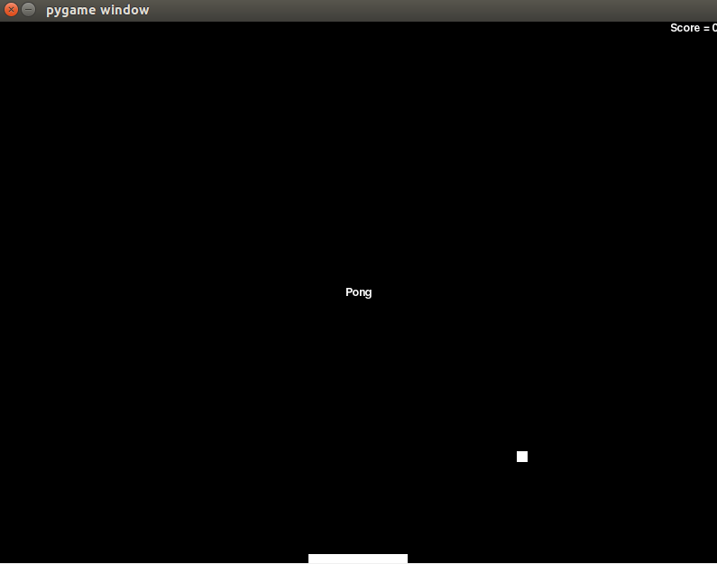

# Pong created in Python by Milosz Kadziela

## Description:
This is my version of a popular game Pong. The aim of the game is currently to bounce the ball as many times as possible with your paddle. The paddle can by moved using arrow keys (LEFT and RIGHT)

## Screenshot of the game:

## Controls:
To control the paddle use arrow keys (LEFT, RIGHT)

## Prerequisites:
- Python 2
- Pygame (compatible with Python 2)

## How to set up:
1. Open terminal
2. Run the project `python FlappyBird-MK.py`

## Future improvements:
- Add main menu
- Add end-game screen so that the game doesn't shut down after losing
- Add two player mode